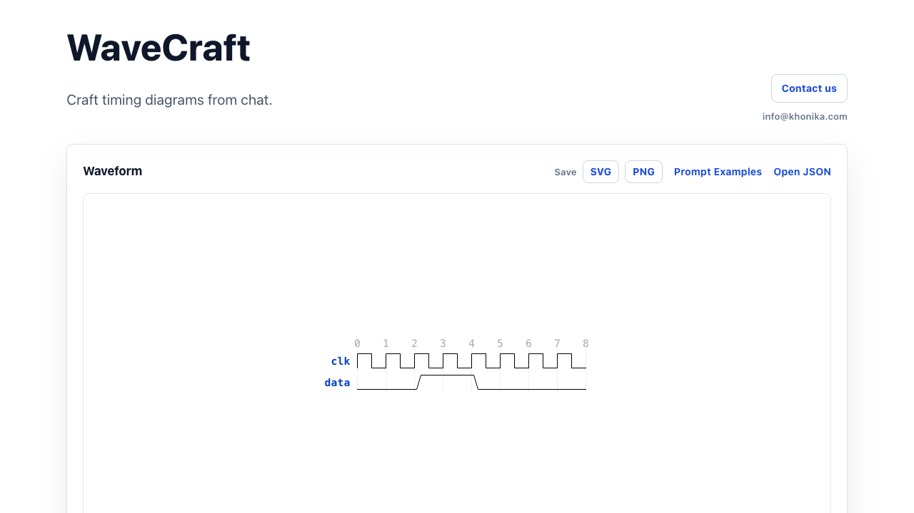
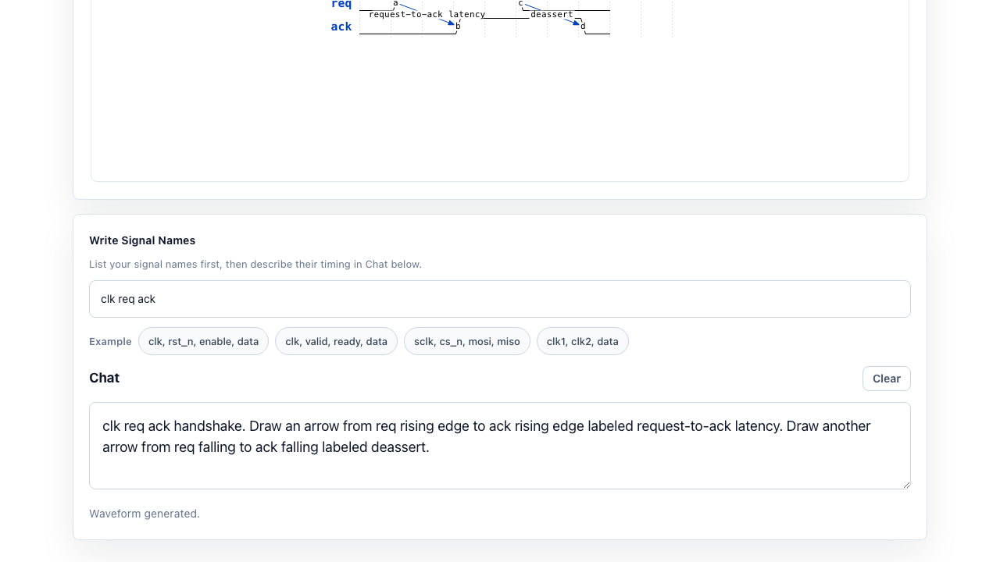
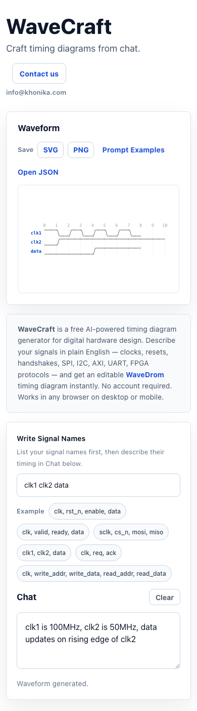

# WaveCraft

**AI-powered timing diagram generator for digital hardware design.**

🔗 **[Open WaveCraft → khonikatech.com/wavecraft](https://www.khonikatech.com/wavecraft)**

---

## What is WaveCraft?

WaveCraft turns plain-English descriptions into editable [WaveDrom](https://wavedrom.com) timing diagrams — instantly, in the browser, with no account required.

Describe your signals in plain English:

> *"clk1 is 100MHz, clk2 is 150MHz, data updates on the rising edge of clk2"*

Get a timing diagram:

---

## How It Works

1. **Write Signal Names** — list your hardware signals (`clk valid ready data`)
2. **Describe timing in Chat** — plain English, no syntax required
3. **Get an instant diagram** — rendered WaveDrom SVG, editable JSON

---

## Features

- **Multi-clock domains** — specify frequencies, WaveCraft handles period ratios automatically
- **Timing annotations** — arrows between signals with latency labels
- **Context-aware editing** — add/remove/move signals without losing others
- **Protocol examples** — SPI, I2C, AXI, UART, APB, AXI-Stream, FIFO, BRAM, and more
- **Save as SVG or PNG**
- **Works on mobile and desktop**
- **Free, no sign-up required**

---

## Example Prompts

| Signal Names | Prompt |
|---|---|
| `clk rst_n enable data` | *reset low for 3 cycles then releases, enable asserts one cycle later* |
| `clk valid ready data` | *valid-ready handshake with one stall cycle* |
| `sclk cs_n mosi miso` | *SPI mode 0 transfer 8 bits* |
| `clk req ack` | *draw an arrow from req rising edge to ack rising edge labeled latency* |
| `clk1 clk2 data` | *clk1 is 100MHz, clk2 is 150MHz, data updates on clk2 rising edge* |

---

## Timing Annotations with Arrows

WaveCraft supports WaveDrom edge arrows to annotate latency, setup time, and timing relationships:

---

## Context-Aware Editing

Once a waveform is generated, you can iteratively refine it — move a signal by one cycle, add a new signal, or remove one — without losing the rest:

**Step 1 — Initial generation:**

**Step 2 — Edit: move data_data forward by one cycle:**

---

## Prompt Examples Page

Browse categorized examples for clock basics, handshakes, protocols, FPGA patterns, arrows, groups, and more:

---

## Mobile

Works in Safari and Chrome on iOS and Android:

---

## Try It

**[→ Open WaveCraft](https://www.khonikatech.com/wavecraft)**

**[→ Browse Prompt Examples](https://www.khonikatech.com/wavecraft/prompt-examples)**

---

*Built by [Khonika](https://www.khonikatech.com) · contact: info@khonika.com*
